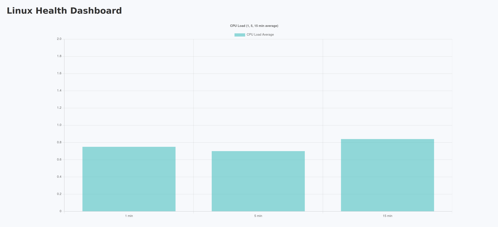

# 🧠 Linux Health Monitor Dashboard

A lightweight system health monitor built with **Ansible**, **AWS S3**, and a static web dashboard. This project periodically collects Linux system metrics and pushes them to a public dashboard for remote monitoring.

---

## 🔧 What It Does

- Collects CPU load, memory usage, disk space, and uptime using **Ansible**
- Saves the metrics in structured `JSON` format
- Uploads the data and a dashboard UI to an **AWS S3 static website**
- Displays live system status with a chart and formatted tables
- Sends email alerts (via Gmail SMTP and `msmtp`) if errors occur
- Runs automatically every 6 hours via `cron`

---

## 📸 Screenshot

> _Add a screenshot here showing the live dashboard!_
> You can take one using `Ctrl + Shift + S` or a tool like Flameshot.



---

## 📁 Tech Stack

| Layer         | Tech Used                                   |
|---------------|---------------------------------------------|
| Monitoring    | Ansible + Bash                              |
| Storage       | AWS S3                                      |
| Visualization | HTML, CSS, JavaScript, Chart.js             |
| Automation    | Cron                                         |
| Notifications | Gmail SMTP via `msmtp`                      |

---

## 🚀 Getting Started

### 🔹 1. Clone the Repo

```bash
git clone https://github.com/yourusername/linux-health-monitor.git
cd linux-health-monitor
```

### 🔹 2. Setup the Python Environment

```bash
python3 -m venv .venv
source .venv/bin/activate
pip install boto3
```

### 🔹 3. Configure AWS

Set up AWS credentials via aws configure

Create an S3 bucket

Enable static website hosting

Edit s3_upload/config.json with your bucket name and region

### 🔹 4. Setup Automation

📄 cron/update_monitor.sh

This script:

    Collects system metrics via Ansible

    Uploads them to S3

    Sends email alerts via msmtp on failure

To run every 6 hours:

```bash
crontab -e
```

```bash
0 */6 * * * /full/path/to/update_monitor.sh >> /path/to/cron.log 2>&1
```


### 🔹 5. Email Alerts via Gmail

1.) Enable 2FA on your Gmail

2.) Generate an App Password

3.) Create ~/.msmtprc with the following:

```bash
defaults
auth on
tls on
tls_trust_file /etc/ssl/certs/ca-certificates.crt
logfile ~/.msmtp.log

account gmail
host smtp.gmail.com
port 587
from your_email@gmail.com
user your_email@gmail.com
password YOUR_APP_PASSWORD

account default : gmail
```

## 👨‍💻 Author

Luke Renchik
Computer Science Student, Oakland University

## 📄 License
MIT License